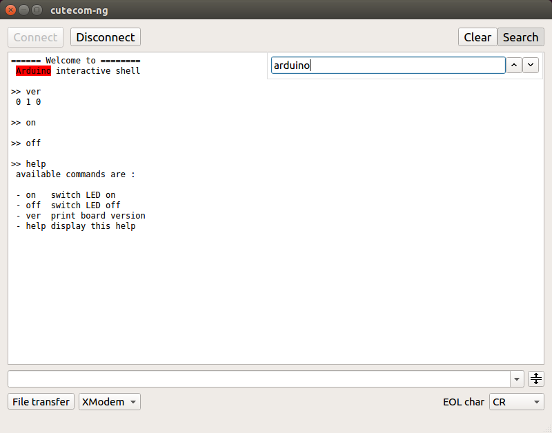

[](https://ci.appveyor.com/project/develer/cutecom-ng)

[](https://travis-ci.org/develersrl/cutecom-ng)

# Cutecom-ng #

Cutecom-ng is a graphical serial port terminal,<br>
&nbsp;&nbsp;running on Linux/Mac OSX and Windows,<br>
&nbsp;&nbsp;written in Qt5

## Screenshot


## Features

 - serial ports auto-detection
 - readline-like history for sent commands
 - splittable terminal window for easy browsing
 - handy search feature
 - configurable end of line char
 - binary or text-mode dump file
 - XModem file transfer
 - more to come... contributions welcome :smiley:

## Installation

### Linux

#### Debian based distributions (eg: Ubuntu, Mint, ...)

 1. download the debian package file [here](https://github.com/develersrl/cutecom-ng/releases)

 2. ```sudo dpkg -i cutecom-ng_0.5_amd64.deb``` <br>

 3. if dpkg complains about some missing dependencies, run:

```sudo apt-get -f install```
or install them yourself

#### Distributions without debian package management

**build the release yourself**

 1. download / install Qt5 and the QSerialPort add-on

 2. clone cutecom-ng repository:  
 ```git clone https://github.com/develersrl/cutecom-ng```

 3. open ./cutecom-ng/cutecom-ng.pro with QtCreator
 4. build

### Windows

 Download zip containing binaries [here](https://github.com/develersrl/cutecom-ng/releases)

**OR**

**build the release yourself**

 1. download / install Qt5 and the QSerialPort add-on

 2. clone cutecom-ng repository:  
 ```git clone https://github.com/develersrl/cutecom-ng```

 3. open ./cutecom-ng/cutecom-ng.pro with QtCreator
 4. build

## Usage / Tips

### Serial port emulation

you can easily emulate a serial port with **gnu-screen**

 1. download and install **gnu-screen**

 for linux distros with apt package management<br>```sudo apt-get install screen```  

 2. if your serial port is `/dev/ttyUSB0`, you do  
```screen /dev/ttyUSB0 115200```<br>to open the port at the specified baudsrate

### Null-modem cable emulation example

To emulate a null-modem connection, you can use **socat** and
**gnu-screen**.

In our example, we will transmit a file with **cutecom-ng** using the XModem
protocol, to a virtual serial port created with socat.<br>**screen** and **rx**
are handling the XModem reception

 1. install **socat**, **gnu-screen** and **lrzsz** packages:<br>
 ```sudo apt-get install socat screen lrzsz```<br>on ubuntu and other **apt**
 based linux distros

 2. open 2 terminals

 3. in the 1st terminal, run:<br>
```socat -d -d pty,raw,echo=1 pty,raw,echo=1```<br>
basically we tell `socat` to create 2 virtual ports and to open them,<br>this is
the kind of output that you should have:
```
2015/07/10 09:36:44 socat[18188] N PTY is /dev/pts/12
2015/07/10 09:36:44 socat[18188] N PTY is /dev/pts/16
2015/07/10 09:36:44 socat[18188] N starting data transfer loop with FDs [3,3] and [5,5]
```
In our example **socat** created and opened
`/dev/pts/12` and `/dev/pts/16`.
Arbitrarily, we will choose to use `/dev/pts/12` for transmission and `/dev/pts/16` for reception.
 4. in the 2nd terminal, run:<br>```screen /dev/pts/16 115200```<br>
this opens a **screen** session on `/dev/pts/16` with a baudsrate of 115200.<br>
Once inside **screen**, *[CTRL-A]* followed by `:` opens a prompt at the bottom
left of the **screen** window, write this command but don't run it:<br>
```exec !! rx filename```<br>
 5. open port ```/dev/pts/12``` in Cutecom-ng, with a baudsrate of 115200 and the
default connection settings
 6. Click on XModem and choose a file to send. After having clicked to start the
transmission, come back to the **gnu-screen** terminal and execute the command
 7. You can now enjoy the full speed of an XModem transmission :sunglasses:

If all goes well, a copy of `myfile` named `filename` should be created in the
directory you were when you opened the screen session.

:exclamation: Warning, if filename exists it will be overwritten

### more fun with socat :

#### use cutecom-ng as a shell terminal :
do
```
socat -d -d pty,raw,echo=1 SYSTEM:"/bin/bash"
```
and connect cutecom-ng to the PTY created by socat

## Contribute

All contributions are welcome!

Please respect the following guidelines when
contributing

### Issues

Don't hesitate to create issue
[here](https://github.com/develersrl/cutecom-ng/issues/new)

include as many details as you can possibly get

## Credits

People and project deserving credits are listed in [CREDITS](./CREDITS)

## License

Cutecom-ng is released under the GPL3, see [LICENSE](./LICENSE)
